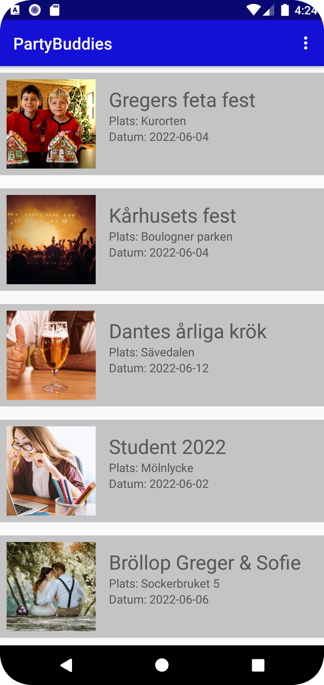
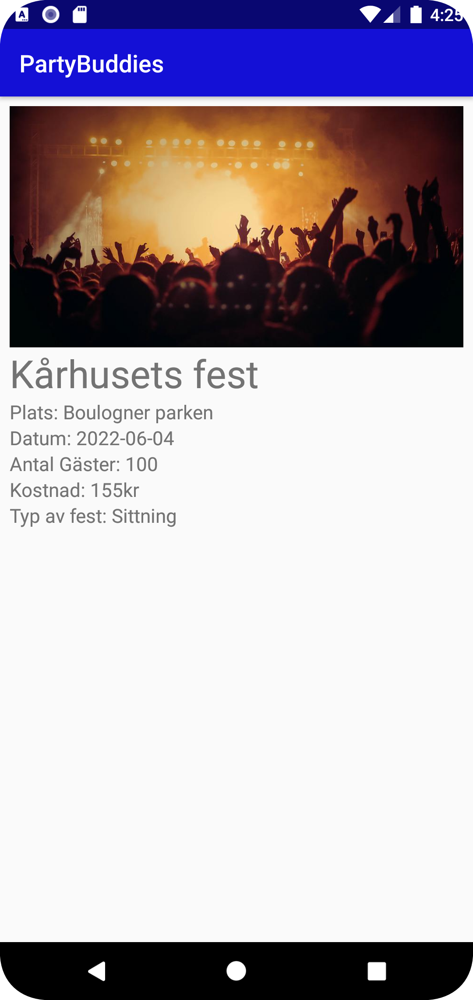

# Rapport

Forked the project from Lenasys github and enabled internet access on the app.
Then Added Recyclerview in activity_main.xml and added list_events.xml with all fields needed for the project. Also added placeholder string in strings.xml
After the list_events I added a toolbar above the recyclerview and added menu_main.xml.
Now the toolbar need to use the menu so added onCreateOptionsMenu(Menu menu) to inflate the menu. Then I added items into the menu_main.xml with more strings.
Now the menu works and the app needs an about page so created a new intent to start AboutPage. Added the aboutPage into the manifest and created a XML file, about_page.xml. The about page is an simple page with only a TextView.
Now the app needs to fetch data from the API. To fetch data from the API the app needs a JsonTask.java file. In MainActivity the JsonTask(this).execute(JSON_URL) needs to be in the onCreate to get run the JsonTask.
In onPostExecute runs when the data is fetched and now for now it only logs the data to make sure the data is correct. The data is correct and the data needs to be an Event object. The Event object is an Java class with all the fields from the data.
The data have fields named name, location, category, size, cost and Auxdata. Because Auxdata is a object I needed to create a new class for Auxdata to insert the fields into the correct variables.
Every variables in Event has getters to get the data for each variables.
Now the Event works with data and the recyclerview needs to view all the correct data. Created EventAdapter which uses holder to setText to each textView. Because the image is an URL I imported Glide as an external library to load IMG from URL and into to the ImageView in eventList.

Each event in the recyclerview needs to be clickable. To make them clickable I created an interface SelectListener with the method onItemClicked(Event event).
In each item in recyclerview I setOnClickListener on the constraintLayout which makes the whole event clickable and not only the tittle. When its clicked it uses the interface onItemClicked(event.get(holder.getAdapterPosition()) which gets the event that is clicked. When the item is clicked the MainActivity runs onItemClicked method which creates a new intent(EventDetail.java).
The EventDetail takes JSON from the intent extras and use GSON to go from JSON to an Event object and put all the data in the correct TextViews. Uses Glide to insert the image from URL.

Now the Recyclerview views all the data but needs to filter them out on a specific condition which is if cost is lower or higher than 50kr. I do it with the toolbar menu. When the item is clicked in the menu it runs a method. The method either removes the Events with high cost or low cost.
The methods uses a for loop to go through all events and if the cost is more than 50 it get removed from the ArrayList. When the filter is resets the filterList clears and then add all events from eventList. eventList never changes once it fetched data.

The app now filters the ArrayList but it needs to save the filter if the app closes. To save the preference I use SharedPreferences. If the user clicks the filter to show cost < 50 I save the filter as string "smallCost" and puts it into the sharedPreferences.
And because the data needs to be fetched to filter I remove the Events from the sharedPreferences in onPostExecute.


```Java

//Event class
public class Event {

    private final String ID;
    private final String name;
    private final String location;
    private final String category;
    private final int size;
    private final int cost;
    private Auxdata auxdata;

    public Event(String ID, String name, String location, String category, int size, int cost, Auxdata auxdata) {
        this.ID = ID;
        this.name = name;
        this.location = location;
        this.category = category;
        this.size = size;
        this.cost = cost;
        this.auxdata = auxdata;
    }

    private class Auxdata {
       private String img;
       private Date datum;

        public Auxdata(String img, Date datum) {
           this.img = img;
           this.datum = datum;
        }

        public String getImg() {
             return img;
        }

    }

//Auxdata in the API
{"img":"IMAGEURL", "datum":"2022-06-06"}

//MainActivity where the data is inserted into an ArrayList<Event> as Event object and notify the eventAdapter that data set changed.
 public void onPostExecute(String json) {
    Gson gson = new Gson();
    Type type = new TypeToken<ArrayList<Event>>() {}.getType();
    ArrayList<Event> fetchedEventList = gson.fromJson(json, type);
    filterList.addAll(fetchedEventList);
    eventList.addAll(fetchedEventList);
    eventAdapter.notifyDataSetChanged();

   //Removes big cost from the filterList from sharedPreferences.
   if(prefs.getString("filter", "default").equals("smallCost")) {
        removeBigCost(filterList);
   }
 }
  //onItemClicked is only on one item in the recyclerview. takes the event into a JSON again to make it easier to send it with intent bundle.
  public void onItemClicked(Event event) {
         Gson gson = new Gson();
         String eventJson = gson.toJson(event);
         Intent intent = new Intent(MainActivity.this, EventDetail.class);
         intent.putExtra("Event", eventJson);
         startActivity(intent);
  }

    //If the user clicks filter on show Events with cost < 50 it saves the filter into the sharedPreferences
    if (id == R.id.small_cost) {
        String filter = "smallCost";
        prefs = getSharedPreferences("filter", MODE_PRIVATE);
        editPrefs = prefs.edit();
        editPrefs.putString("filter", filter);
        editPrefs.apply();

        removeBigCost(filterList);
    }

 //remove Event with high cost. The removeSmallCost is the same but has filterList.get(i).getCost() < 50.
 public void removeBigCost(ArrayList<Event> event) {
        for (int i = 0; i < filterList.size(); i++){
            if (filterList.get(i).getCost() > 50) {
                filterList.remove(filterList.get(i));
                i--;
            }
        }
        eventAdapter.notifyDataSetChanged();
    }

    //Resets the filterList and the add all items from eventList
    if(id == R.id.reset_list) {
            filterList.clear();
            filterList.addAll(eventList);
            eventAdapter.notifyDataSetChanged();
        }

// SelectListener interface
public interface SelectListener {
    void onItemClicked(Event event);
}

//EventAdapter with setOnClickListener. Sets onClick on each item in the recyclerview.
holder.singleItem.setOnClickListener(new View.OnClickListener() {
            @Override
            public void onClick(View view) {
                listener.onItemClicked(event.get(holder.getAdapterPosition()));
            }
        });


//EventDetail "unpack" the JSON for the Event and then put all the data into each textView.
ImageView eventImg = findViewById(R.id.event_img);
TextView eventTitle = findViewById(R.id.event_title);
TextView eventLocation = findViewById(R.id.event_location);
TextView eventDate = findViewById(R.id.event_date);
TextView eventGuest = findViewById(R.id.event_guest);
TextView eventCost = findViewById(R.id.event_cost);
TextView eventCategory = findViewById(R.id.event_category);

 Bundle extras = getIntent().getExtras();

 if(extras != null){
            Gson gson = new Gson();
            Type type = new TypeToken<Event>() {}.getType();
            Event event = gson.fromJson(extras.getString("Event"), type);
            Glide.with(this).load(event.getAuxdata().getImg()).into(eventImg);
            eventTitle.setText(event.getName());
            eventLocation.setText("Plats: " + event.getLocation());
            eventDate.setText("Datum: " + event.getAuxdata().getDatum());
            eventGuest.setText("Antal Gäster: " + event.getSizeString());
            eventCost.setText("Kostnad: " + event.getCostString() + "kr");
            eventCategory.setText("Typ av fest: " + event.getCategory());
 }
```



